# 🌱 Stand-Alone Sensor Node for Remote Field Monitoring - [National Bank for Agriculture and Rural Development (NABARD)]

A solar-powered IoT-based environmental monitoring system for remote agricultural fields using ESP32 with integrated GSM/GPRS connectivity. This system enables autonomous, real-time monitoring of soil moisture, temperature, humidity, and water conditions in areas beyond Wi-Fi coverage.

[](https://www.arduino.cc/)
[](https://www.espressif.com/)
[](https://thingspeak.com/)

---

## 📑 Table of Contents

- [Overview](#overview)
- [Features](#features)
- [System Architecture](#system-architecture)
- [Hardware Components](#hardware-components)
- [Software Stack](#software-stack)
- [Installation](#installation)
  - [Hardware Setup](#hardware-setup)
  - [Software Setup](#software-setup)
- [Communication Protocol](#communication-protocol)
- [Data Visualization](#data-visualization)
- [Applications](#applications)


---

## 🎯 Overview

The **Stand-Alone Sensor Node for Remote Field Monitoring** is a NABARD-supported project designed to monitor critical environmental parameters in remote agricultural locations where traditional Wi-Fi connectivity is unavailable. This autonomous system utilizes solar energy and cellular networks (GPRS) to provide continuous monitoring and data transmission capabilities.

### About NABARD

NABARD (National Bank for Agriculture and Rural Development) is a development bank focusing primarily on the rural sector of India. It is the apex banking institution to provide finance for agriculture and rural development. NABARD's initiatives are aimed at building an empowered and financially inclusive rural India.

### Key Objectives

- ✅ Monitor soil moisture levels for irrigation management
- ✅ Track environmental temperature and humidity
- ✅ Measure water temperature in reservoirs
- ✅ Operate autonomously in remote locations without Wi-Fi
- ✅ Utilize renewable solar energy for sustainable operation
- ✅ Enable remote data access via cellular networks
- ✅ Support precision agriculture practices

---

## ✨ Features

### Environmental Monitoring
- 💧 **Soil Moisture Tracking** using capacitive sensor (V1.2)
- 🌡️ **Air Temperature & Humidity** monitoring with SHT20 sensor
- 🌊 **Water Temperature Monitoring** with DS18B20 sensor
- 📊 **Real-time Data Transmission** via GPRS/cellular network

### Technical Features
- 📱 **GSM/GPRS Connectivity** through integrated SIM800L module
- ☀️ **Solar-Powered Operation** with battery backup
- 🔋 **Intelligent Power Management** with solar charge controller
- 🌐 **Cloud Integration** with ThingSpeak for data visualization
- 💾 **12-bit ADC Resolution** for accurate sensor readings
- 💡 **LED Status Indicators** for system monitoring

### System Capabilities
- 🔌 **Fully Stand-Alone** - operates independently without Wi-Fi
- 📈 **Historical Data Logging** for trend analysis
- 🌍 **Remote Accessibility** from anywhere with internet
- ⚡ **Energy-Efficient Design** with deep sleep modes
- 🛡️ **Weather-Resistant** enclosure for outdoor deployment
- 🔄 **Scalable Architecture** for multiple sensor deployment

---

## 🏗️ System Architecture

```mermaid
graph TD
    subgraph "SENSOR LAYER"
        A1["💧 Capacitive Soil<br/>Moisture Sensor V1.2"]
        A2["🌡️ SHT20<br/>Temperature & Humidity"]
        A3["🌊 DS18B20<br/>Water Temperature"]
    end

    subgraph "PROCESSING & COMMUNICATION"
        B["🖥️ TTGO T-Call<br/>ESP32 SIM800L<br/>Data Processing<br/>GSM/GPRS Module"]
    end

    subgraph "POWER SYSTEM"
        C1["☀️ Solar Panel<br/>3W Output"]
        C2["🔋 Solar Charge<br/>Controller SY2024H"]
        C3["🔋 Lead-Acid Battery<br/>12V"]
    end

    subgraph "CLOUD PLATFORM"
        D["☁️ ThingSpeak Server<br/>Real-time Storage<br/>Data Visualization<br/>Remote Access"]
    end

    subgraph "MONITORING"
        E1["💡 Power LED<br/>Red"]
        E2["💡 Data Acquisition LED<br/>Yellow"]
        E3["💡 Data Logging LED<br/>Yellow"]
    end

    A1 --> B
    A2 --> B
    A3 --> B
    C1 --> C2
    C2 --> C3
    C3 --> B
    B -->|GPRS Data Transfer| D
    B --> E1
    B --> E2
    B --> E3

    style A1 fill:#11998e,stroke:#0d7a6f,stroke-width:2px,color:#fff
    style A2 fill:#11998e,stroke:#0d7a6f,stroke-width:2px,color:#fff
    style A3 fill:#11998e,stroke:#0d7a6f,stroke-width:2px,color:#fff
    style B fill:#f093fb,stroke:#d66de8,stroke-width:2px,color:#fff
    style C1 fill:#feca57,stroke:#ee5a24,stroke-width:2px,color:#fff
    style C2 fill:#feca57,stroke:#ee5a24,stroke-width:2px,color:#fff
    style C3 fill:#feca57,stroke:#ee5a24,stroke-width:2px,color:#fff
    style D fill:#fa709a,stroke:#f54278,stroke-width:2px,color:#fff
    style E1 fill:#ff6348,stroke:#ff4757,stroke-width:2px,color:#fff
    style E2 fill:#ffa502,stroke:#ff7f50,stroke-width:2px,color:#fff
    style E3 fill:#ffa502,stroke:#ff7f50,stroke-width:2px,color:#fff
```


### Data Flow
1. **Sensors** continuously capture environmental parameters (soil moisture, air temperature, humidity, water temperature)
2. **ESP32 Microcontroller** processes and formats sensor data
3. **SIM800L Module** establishes GPRS connection via cellular network
4. **Data Transmission** sends formatted data to cloud via HTTP POST
5. **ThingSpeak Server** stores and visualizes data in real-time
6. **Solar Power System** ensures continuous autonomous operation

---

## 🔧 Hardware Components

| Component | Model | Purpose | Specifications |
|-----------|-------|---------|----------------|
| **Microcontroller** | TTGO T-Call ESP32 SIM800L | Processing & GSM communication | Dual-core 240MHz, 520KB SRAM, integrated GSM |
| **Soil Moisture Sensor** | Capacitive V1.2 | Soil moisture monitoring | 3.3V-5.5V, 1.2V-3.0V output, corrosion-resistant |
| **Temp & Humidity Sensor** | SHT20 | Air temperature & humidity | ±0.3°C, ±3%RH accuracy, I2C interface |
| **Water Temperature Sensor** | DS18B20 | Water temperature monitoring | -55°C to +125°C, ±0.5°C accuracy, 1-Wire |
| **Solar Panel** | 3W Output | Primary power source | 10.20V open circuit, 0.35A max current |
| **Charge Controller** | SY2024H | Battery charging management | 12V-24V, 20A, built-in protections |
| **Battery** | Lead-Acid 12V | Energy storage | 12V DC, powers entire system |
| **LEDs** | Standard (×3) | Status indication | Power, data acquisition, data logging |

### Detailed Component Specifications

#### TTGO T-Call ESP32 SIM800L
- **Microcontroller**: Dual-core Xtensa LX6, 240MHz
- **Memory**: 520KB SRAM, up to 4MB flash
- **Connectivity**: Wi-Fi 802.11 b/g/n, Bluetooth 4.2, GSM/GPRS
- **GSM Bands**: Quad-band 850/900/1800/1900 MHz
- **ADC**: 12-bit resolution, multiple channels
- **Operating Voltage**: 5V DC via USB or battery
- **Features**: Integrated SIM800L module, onboard antenna, SIM card slot

#### Capacitive Soil Moisture Sensor V1.2
- **Interface**: Analog (PH2.0-3P connector)
- **Voltage**: 3.3V to 5.5V DC
- **Output Range**: 1.2V to 3.0V
- **Technology**: Capacitive sensing (corrosion-resistant)
- **Wire Colors**: Red (Vcc), Black (GND), Yellow (Data)
- **Advantage**: Does not corrode like resistive sensors

#### SHT20 - Temperature & Humidity Sensor
- **Interface**: I2C (RS485 protocol)
- **Voltage**: 2.1V to 3.6V (recommended 3.0V)
- **Power**: Maximum 0.2W
- **Temperature Range**: -20°C to +60°C
- **Humidity Range**: 0-100%RH
- **Accuracy**: ±0.3°C (temperature), ±3%RH (humidity) at 25°C
- **Wire Colors**: Red (Vcc), Black (GND), Yellow (SDA), Green (SCL)

#### DS18B20 - Water Temperature Sensor
- **Interface**: 1-Wire digital protocol
- **Voltage**: 3V to 5.5V DC
- **Temperature Range**: -55°C to +125°C
- **Accuracy**: ±0.5°C
- **Wire Colors**: Red (Vcc), Black (GND), Yellow (Data)
- **Note**: Requires 4.7kΩ pull-up resistor

#### Solar Charge Controller SY2024H
- **Voltage**: 12V-24V auto-detection
- **Current**: 20A charging/discharging
- **Solar Input**: Less than 50V maximum
- **Operating Temperature**: -35°C to 60°C
- **Protection Features**:
  - Short circuit protection
  - Open circuit protection
  - Reverse voltage protection
  - Overload protection

#### Solar Panel (3W)
- **Open Circuit Voltage**: 10.20V
- **Short Circuit Current**: 0.39A
- **Maximum Power Voltage**: 8.70V
- **Maximum Power Current**: 0.35A
- **Output Power**: 3W
- **Type**: Polycrystalline/Monocrystalline

#### LED Indicators
- **Power LED (Red)**: Illuminates when system is powered
- **Data Acquisition LED (Yellow)**: Lights up during sensor readings
- **Data Logging LED (Yellow)**: Blinks when transmitting data to cloud

---

## 💻 Software Stack

### Development Environment
- **IDE**: Arduino IDE 2.0 or higher
- **Programming Language**: Arduino C/C++
- **Communication Protocol**: GPRS/HTTP
- **Cloud Platform**: ThingSpeak

### Key Arduino Libraries
```cpp
// Sensor Libraries
#include <Wire.h>              // I2C communication
#include <OneWire.h>           // Dallas temperature sensor
#include <DallasTemperature.h> // DS18B20 interface

// Communication
#define TINY_GSM_MODEM_SIM800  // GSM module definition
#include <TinyGsmClient.h>     // GSM client library
#include <Arduino.h>           // Core Arduino functions

// Additional
#include <HardwareSerial.h>    // Serial communication
```

### Required Libraries Installation
- Wire (Built-in)
- OneWire
- DallasTemperature
- TinyGSM
- Arduino (Built-in)
- HardwareSerial (Built-in)

---

## 📥 Installation

### Hardware Setup

#### Required Components
- TTGO T-Call ESP32 SIM800L × 1
- Capacitive Soil Moisture Sensor V1.2 × 1
- SHT20 Temperature & Humidity Sensor × 1
- DS18B20 Water Temperature Sensor × 1
- Solar Panel (3W) × 1
- Solar Charge Controller SY2024H × 1
- Lead-Acid Battery (12V) × 1
- LEDs × 3 (Red, Yellow, Yellow)
- 4.7kΩ Resistors (for DS18B20)
- 220Ω Resistors (for LEDs) × 3
- SIM Card with active data plan (BSNL 4G used)
- Weather-resistant enclosure
- Connecting wires
- PCB/Perfboard

#### Pin Connections

**Capacitive Soil Moisture Sensor:**
```
ESP32 Pin    →    Sensor
GPIO 34      →    Data (Yellow) [ADC Pin]
3.3V         →    Vcc (Red)
GND          →    GND (Black)
```

**SHT20 Temperature & Humidity Sensor:**
```
ESP32 Pin    →    SHT20
GPIO 21      →    SDA (Yellow)
GPIO 22      →    SCL (Green)
3.3V         →    Vcc (Red)
GND          →    GND (Black)
```

**DS18B20 Water Temperature Sensor:**
```
ESP32 Pin    →    DS18B20
GPIO 15      →    Data (Yellow) - via 4.7kΩ pullup
3.3V         →    Vcc (Red)
GND          →    GND (Black)
```

**SIM800L Module (Integrated on TTGO T-Call):**
```
Pre-wired on TTGO T-Call board
Insert SIM card in onboard slot
Antenna connected to antenna port
```

**Status LEDs:**
```
ESP32 Pin    →    LED
GPIO 12      →    Power LED (Red) - via 220Ω resistor
GPIO 13      →    Data Acquisition LED (Yellow) - via 220Ω
GPIO 14      →    Data Logging LED (Yellow) - via 220Ω
All LEDs     →    GND (cathode)
```

**Power System:**
```
Solar Panel (+)  →  Solar Charge Controller (Solar +)
Solar Panel (-)  →  Solar Charge Controller (Solar -)
Battery (+)      →  Charge Controller (Battery +)
Battery (-)      →  Charge Controller (Battery -)
Load (+)         →  ESP32 5V Input
Load (-)         →  ESP32 GND
```

#### Assembly Steps

1. **SIM Card Installation**
   - Insert activated SIM card with data plan into TTGO T-Call slot
   - Ensure SIM card is properly seated and locked

2. **PCB Preparation**
   - Solder TTGO T-Call ESP32 onto perfboard/PCB
   - Solder connecting pins and terminal blocks
   - Add 4.7kΩ pull-up resistor for DS18B20 data line
   - Solder 220Ω resistors in series with LEDs

3. **Sensor Connections**
   - Connect soil moisture sensor to ADC pin (GPIO 34)
   - Wire SHT20 to I2C pins (GPIO 21, 22)
   - Connect DS18B20 with 4.7kΩ pullup resistor
   - Use appropriate wire lengths for field deployment (3.5m recommended)

4. **LED Indicators**
   - Connect power LED to GPIO 12 via 220Ω resistor
   - Connect data acquisition LED to GPIO 13 via 220Ω resistor
   - Connect data logging LED to GPIO 14 via 220Ω resistor
   - Connect all cathodes to common GND

5. **Power System Assembly**
   - Mount solar panel on pole or frame with south-facing orientation
   - Connect solar panel to charge controller solar input
   - Connect battery to charge controller battery terminals
   - Wire charge controller load output to ESP32 power input
   - Ensure all connections are secure and properly insulated

6. **Enclosure Assembly**
   - Drill cable entry holes in weather-resistant enclosure
   - Mount PCB inside enclosure using standoffs
   - Pass sensor cables through cable glands
   - Seal all entry points with silicone or appropriate sealant
   - Ensure battery and charge controller fit securely

7. **Field Deployment**
   - Position enclosure in monitoring location
   - Insert soil moisture sensor in the soil till the mark on the sensor
   - Place DS18B20 in water reservoir or irrigation line
   - Mount SHT20 in shaded, ventilated area
   - Orient solar panel for maximum sun exposure
   - Secure all components against weather and wildlife

8. **Testing**
   - Power up the system
   - Verify power LED illumination
   - Check sensor readings via Serial Monitor
   - Confirm GSM signal strength (check module LEDs)
   - Test data transmission to ThingSpeak
   - Monitor solar charging functionality

#### Circuit Schematic


#### Breadboard Implementation 


#### Final circuit


#### Deployed sensor node


---

### Software Setup

#### Prerequisites
- Arduino IDE 2.0 or higher installed
- ESP32 Board Support installed in Arduino IDE
- All required libraries installed (see Software Stack section)
- ThingSpeak account created with channel configured
- Active SIM card with data plan
- Basic knowledge of Arduino programming

#### Arduino IDE Configuration

1. **Install ESP32 Board Support**
```
   File → Preferences → Additional Board Manager URLs
   Add: https://dl.espressif.com/dl/package_esp32_index.json
   Tools → Board → Board Manager → Search "ESP32" → Install
```

2. **Install Required Libraries**
```
   Sketch → Include Library → Manage Libraries
   Search and install:
   - OneWire
   - DallasTemperature
   - TinyGSM (by Volodymyr Shymanskyy)
```

3. **Board Selection**
```
   Tools → Board → ESP32 Arduino → TTGO T-Call
   Tools → Upload Speed → 115200
   Tools → CPU Frequency → 240 MHz
   Tools → Flash Frequency → 80 MHz
   Tools → Partition Scheme → Default
```

#### Code Configuration

1. **Clone Repository**
```bash
   git clone https://github.com/yourusername/nabard-sensor-node.git
   cd nabard-sensor-node
```

2. **Configure Network Credentials**
   Edit main sketch file:
```cpp
   // APN Settings (adjust for your network provider)
   const char apn[]  = "bsnlnet";           // BSNL APN
   const char user[] = "";                   // Usually empty for BSNL
   const char pass[] = "";                   // Usually empty for BSNL
   
   // For other providers:
   // Airtel: "airtelgprs.com"
   // Jio: "jionet"
   // Vodafone: "www" or "portalnmms"
```

3. **Configure ThingSpeak Credentials**
```cpp
   // ThingSpeak Settings
   const char* THINGSPEAK_API_KEY = "YOUR_WRITE_API_KEY_HERE";
   const unsigned long CHANNEL_ID = YOUR_CHANNEL_ID;
   const char* server = "api.thingspeak.com";
```

4. **Configure Sensor Pins**
   Verify pin definitions match your hardware:
```cpp
   // Sensor Pin Definitions
   #define SOIL_MOISTURE_PIN 34   // ADC pin for soil moisture
   #define ONE_WIRE_BUS 15        // DS18B20 data pin
   #define SHT20_SDA 21           // SHT20 SDA
   #define SHT20_SCL 22           // SHT20 SCL
   
   // LED Pin Definitions
   #define POWER_LED 12
   #define DATA_ACQ_LED 13
   #define DATA_LOG_LED 14
```

5. **Configure Sampling Intervals**
```cpp
   // Timing Configuration
   const unsigned long SENSOR_READ_INTERVAL = 5000;   // 5 seconds
   const unsigned long UPLOAD_INTERVAL = 60000;        // 60 seconds
```

6. **Upload Code**
   - Open `nabard_sensor_node.ino` in Arduino IDE
   - Connect TTGO T-Call via USB
   - Select correct COM port: `Tools → Port`
   - Click Upload button
   - Monitor Serial output: `Tools → Serial Monitor` (115200 baud)

7. **Initial Testing**
   - Open Serial Monitor after upload
   - Verify sensor initialization messages
   - Check GSM connection status
   - Confirm ThingSpeak data transmission
   - Monitor LED indicators for proper operation

#### Code Structure
```
nabard-sensor-node/
├── nabard_sensor_node.ino       # Main Arduino sketch
├── config.h                      # Configuration settings
├── gsm_functions.cpp            # GSM/GPRS functions
├── gsm_functions.h              # GSM function declarations
├── sensor_functions.cpp         # Sensor reading functions
├── sensor_functions.h           # Function declarations
├── README.md                    # This file
├── LICENSE                      # License file
├── circuit_diagram.png          # Circuit schematic
├── breadboard_setup.png         # Breadboard layout
├── final_pcb.png               # PCB design
└── complete_sensor_node.png    # Complete assembly
```

---

## 📡 Communication Protocol: GPRS/GSM

This system uses GPRS (General Packet Radio Service) over GSM networks for data transmission, enabling connectivity in remote areas without Wi-Fi coverage.

### Why GPRS?

✅ **Wide Coverage** - Works anywhere with cellular signal  
✅ **Low Cost** - Affordable data plans available  
✅ **Reliable** - Established network infrastructure  
✅ **No Router Required** - Direct cellular connection  
✅ **Remote Deployment** - Ideal for field locations  
✅ **Always-On Connectivity** - Maintains connection even in sleep mode

### SIM800L Module Features

The integrated SIM800L module on the TTGO T-Call provides:

- **Quad-Band GSM**: 850/900/1800/1900 MHz
- **GPRS Multi-Slot Class**: 12/10
- **GPRS Mobile Station Class**: B
- **HTTP Protocol Support**: Direct API calls to ThingSpeak
- **SMS Capabilities**: For alerts and notifications
- **Low Power Consumption**: Sleep modes for battery conservation

### Data Transmission Process
```
[Sensor Data Collection] → [ESP32 Processing] → [Format JSON/HTTP]
         ↓
[SIM800L Module] → [GPRS Connection] → [HTTP POST Request]
         ↓
[ThingSpeak Server] → [Data Storage] → [Visualization]
```

### Network Configuration

The system supports major Indian cellular providers:

- **BSNL**: APN - "bsnlnet"
- **Airtel**: APN - "airtelgprs.com"
- **Jio**: APN - "jionet"


### Configuration Example
```cpp
// GSM initialization
#define MODEM_RX 26
#define MODEM_TX 27
HardwareSerial SerialAT(1);

TinyGsm modem(SerialAT);
TinyGsmClient client(modem);

void setupGSM() {
  SerialAT.begin(115200, SERIAL_8N1, MODEM_RX, MODEM_TX);
  
  Serial.println("Initializing modem...");
  modem.restart();
  
  // Wait for network
  Serial.print("Waiting for network...");
  if (!modem.waitForNetwork()) {
    Serial.println(" failed");
    return;
  }
  Serial.println(" OK");
  
  // Connect to GPRS
  Serial.print("Connecting to GPRS...");
  if (!modem.gprsConnect(apn, user, pass)) {
    Serial.println(" failed");
    return;
  }
  Serial.println(" OK");
}

// Send data to ThingSpeak
void sendData(float moisture, float temp, float humidity, float waterTemp) {
  String url = "/update?api_key=" + String(THINGSPEAK_API_KEY);
  url += "&field1=" + String(moisture);
  url += "&field2=" + String(temp);
  url += "&field3=" + String(humidity);
  url += "&field4=" + String(waterTemp);
  
  if (!client.connect(server, 80)) {
    Serial.println("Connection failed");
    return;
  }
  
  client.print(String("GET ") + url + " HTTP/1.1\r\n");
  client.print(String("Host: ") + server + "\r\n");
  client.print("Connection: close\r\n\r\n");
  
  // Wait for response
  unsigned long timeout = millis();
  while (client.connected() && millis() - timeout < 10000L) {
    while (client.available()) {
      char c = client.read();
      Serial.print(c);
      timeout = millis();
    }
  }
  
  client.stop();
}
```

---

## 📊 Data Visualization

### ThingSpeak Integration

All sensor data is uploaded to ThingSpeak cloud platform for real-time visualization and analysis.

**ThingSpeak Channel Fields:**
- **Field 1**: Air Temperature (°C)
- **Field 2**: Air Humidity (%RH)
- **Field 3**: Soil Moisture (Voltage/Percentage)
- **Field 4**: Water Temperature (°C)


### Data Update Frequency

- **Sensor Reading**: Every 5 seconds
- **Data Processing**: Continuous
- **ThingSpeak Upload**: Every 60 seconds (adjustable)
- **GPRS Connection**: Maintained or re-established as needed

### Data Analysis Features

📈 **Real-time Graphs** - Live visualization of all parameters  
📊 **Historical Trends** - Analyze data patterns over days/weeks/months  
🔔 **Alerts & Notifications** - Set threshold-based alerts via ThingSpeak React  
📉 **Statistical Analysis** - Average, min, max, median calculations  
🌐 **Remote Access** - Monitor from anywhere via web/mobile app  
📱 **Mobile App Integration** - ThingSpeak mobile app for on-the-go monitoring  
🔗 **API Access** - RESTful API for custom applications  

### Data Interpretation

**Soil Moisture Values:**
- 1.2V - 1.5V: Very dry soil (irrigation needed)
- 1.5V - 2.0V: Dry soil (monitor closely)
- 2.0V - 2.5V: Optimal moisture range
- 2.5V - 3.0V: Saturated soil (reduce irrigation)

**Temperature & Humidity:**
- Monitor for optimal growing conditions
- Track daily/seasonal variations
- Correlate with soil moisture for irrigation decisions

**Water Temperature:**
- Ensure irrigation water is not too cold (avoid root shock)
- Monitor reservoir temperature variations
- Optimize watering times based on water temperature

---

## 🌾 Applications

### Precision Agriculture

1. **Irrigation Management**
   - Real-time soil moisture monitoring
   - Automated irrigation scheduling
   - Water conservation through precise application
   - Prevention of over-watering and under-watering

2. **Weather-Based Decision Making**
   - Temperature and humidity tracking
   - Correlation with weather forecasts
   - Proactive irrigation scheduling
   - Frost warning and crop protection

3. **Remote Field Monitoring**
   - Monitor multiple distant fields from central location
   - Reduce manual labor for field inspections
   - Early detection of adverse conditions
   - Historical data for crop planning

4. **Resource Optimization**
   - Reduce water consumption
   - Lower energy costs through efficient irrigation
   - Minimize crop losses due to water stress
   - Improve crop yields and quality
